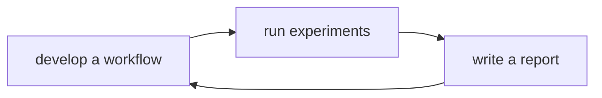

# Project lifecycle

We have defined a project lifecycle to make our experiments reproducible.

A project is made of two components:

1. the workflow: that is all your code to perform analysis and run experiments.
2. the workspace: that is a directory on a cluster or workstation, where all
   your experiments take place.

We have defined templates, called `cookiecutters`, to setup a workflow and a
workspace according to our standards.

Managing your project is a 3 step process:

 

### Develop a workflow

1. Create a workflow using
   [`cookiecutter-workflow-nf`](https://github.com/stracquadaniolab/cookiecutter-workflow-nf). 
   Please, read how to prepare your workflow [here](project-workflow).
2. Write the code for your workflow.
3. Add test data and package required software with Docker.
4. Push your workflow to GitHub.

### Run experiments

1. Create a project workspace using the
   [`cookiecutter-workspace-nf`](https://github.com/stracquadaniolab/cookiecutter-workspace-nf). 
   Please, read carefully how the workspace is organized
   [here](project-workspace).
2. Pull your workflow from GitHub.
3. Set your experimental parameters.
4. Run your experiments.

### Reporting

1. Create a report using the
   [`cookiecutter-report-nf`](https://github.com/stracquadaniolab/cookiecutter-report-nf)
2. Write your report including:
      - methods used and/or implemented;
      - experimental setup, e.g. parameters, workflow version etc.
      - tables and figures
